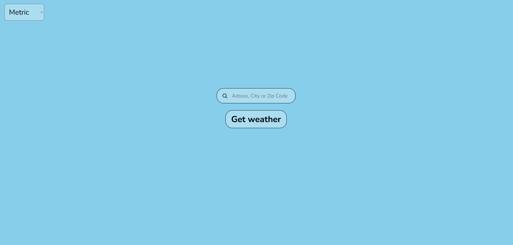
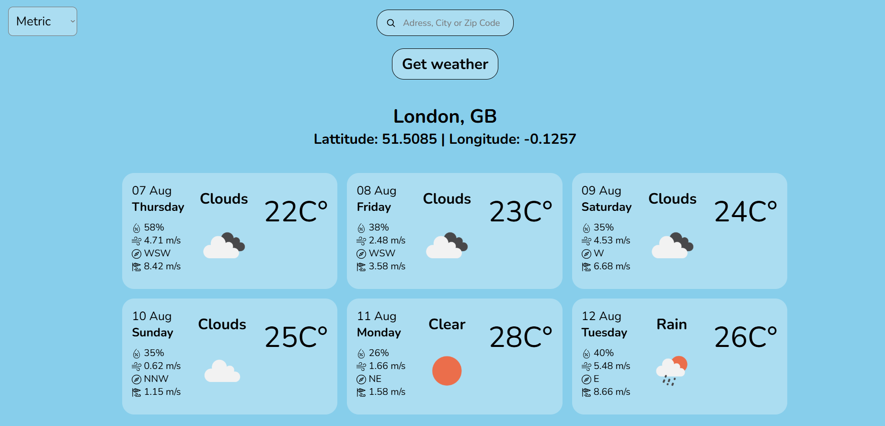
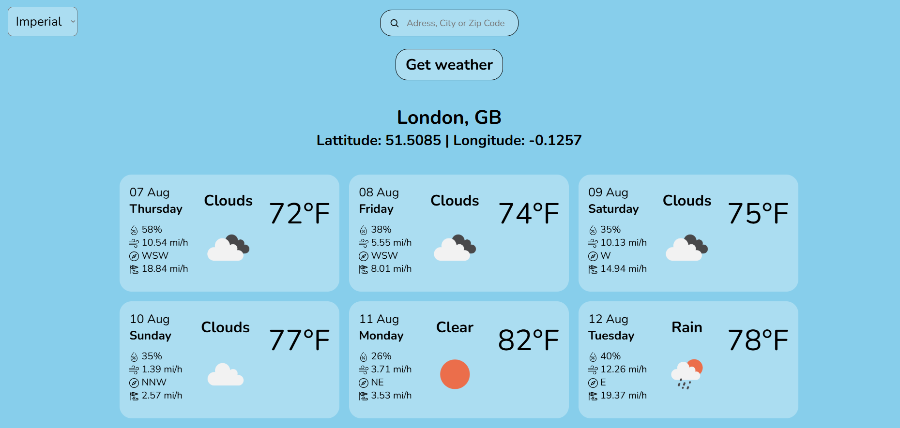

# Weather-app

[Live Demo](https://findbyip.aleksandrebugadze.com)

## Features

- Search weather by city name
- 5-day weather forecast with daily breakdowns
- Displays temperature, humidity, wind speed, and conditions
- Real-time weather updates using external API
- Responsive design for mobile and desktop

## Stack

- HTML
- CSS
- JavaScript
- NodeJs
- ExpressJS
- [OpenweatherAPI](https://openweathermap.org)

## For local hosting

### Clone the repository

```bash
git clone --recursive https://github.com/LeksoBugadze/Weather-app.git
```

### Change link in /public/main.js on line 110 to your server link

### Use [Live Server](https://marketplace.visualstudio.com/items?itemName=ritwickdey.LiveServer) to launch the index.html file in /public

### Run Back-end

```bash
npm run dev
```

# Screenshots




